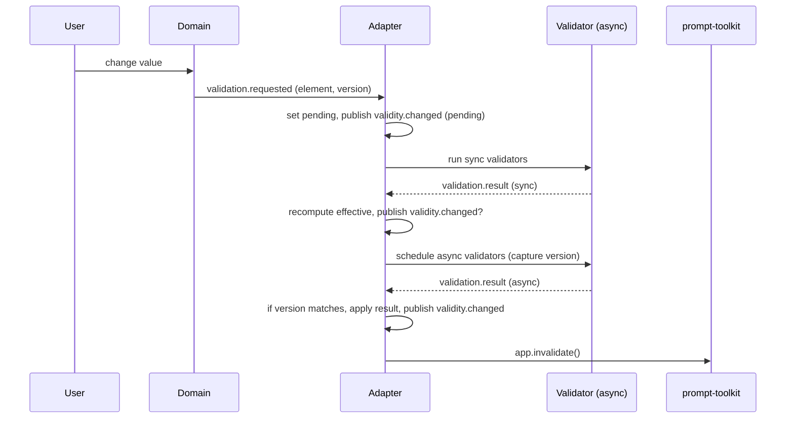

# TUI Engine — Architecture Overview

This document consolidates the current design decisions, reconciles prior design documents, and lays out a concrete implementation plan for the new TUI Engine core.

This file intentionally replaces the earlier multi-class model (Card, Section, Assembly, Spatial engine) with a single, recursive container primitive (ContainerElement) and a prompt-toolkit driven rendering/input pipeline.

## Goals

- Provide a small, consistent core API for composing UI trees.
- Use prompt-toolkit as the canonical rendering and input backbone.
 - Replace the legacy spatial layout engine and adapter indirection with the new ContainerElement core. (If the legacy core has already been removed in the active branch, proceed to scaffold the new core under `src/tui_engine`.)
- Keep domain logic (state, validation, business rules) separate from rendering.
- Ship an explicit migration/refactor plan that is destructive by design (no adapters).

## High-level decisions

1. Single container primitive
   - Replace `Card`, `Section`, and `Assembly` with `ContainerElement`.
   - `ContainerElement` is recursive and can contain other `ContainerElement`s and leaf elements.
   - A `variant`/`style` property controls presentation (e.g. `section`, `card`, `header`, `footer`), not behavior.

2. Prompt-toolkit as renderer and input system
   - All rendering, layout, keyboard handling, and widget behavior will be implemented using `prompt_toolkit` primitives (HSplit, VSplit, Frame, Window, Controls, Widgets, KeyBindings, Application).
   - Use `PromptSession` for blocking prompts and `Application` for continuous UIs.

3. Event and state model
   - Implement a thin domain-level pub/sub event bus for business events (state changes, validation results, navigation events).
   - Map domain events to prompt-toolkit redraws via `app.invalidate()` and prompt-toolkit scheduling (`create_background_task`, asyncio).

4. Dependency Injection
   - Adopt a module-level factory/provider pattern for external dependencies (questionary replacements, prompt-toolkit factories, etc.). See the DI design notes.

5. Destructive refactor policy
  - The plan is deliberately destructive in that we do not plan to maintain adapters for the old spatial engine. Before removing any legacy sources create an archival branch/tag. If the legacy core has already been removed in your working branch, continue by scaffolding the new core under `src/tui_engine` and ensure a backup exists in git history or on the remote.

## Why these choices

- Simplicity: One container type avoids conceptual duplication and simplifies the public API.
- Predictability: Mapping directly to prompt-toolkit reduces the amount of custom layout code we must maintain and leverages a mature layout/event system.
- Separation of concerns: Domain model and UI rendering are cleanly separated. The UI layer is an adapter over the domain tree.

## Public API contract (sketch)

- ContainerElement(name: str, variant: str = "container", style: Optional[dict] = None)
  - add_child(child)
  - remove_child(child)
  - get_render_lines(width: int = 80) -> List[str]
  - to_ptk_container() -> prompt_toolkit.container (adapter function)
  - visible: bool; mark_dirty(); clear_dirty(); metadata/state dict

- Page(title: str = "")
  - add_element(elem)
  - render()  # for non-interactive or debug flows
  - run_application() -> starts a prompt-toolkit Application using an adapter

Note: `to_ptk_container()` is an internal adapter used to transform a ContainerElement tree into a prompt-toolkit layout (HSplit/VSplit/Frame). It is not intended for library consumers.

## Fluent API (end-consumer)

This section describes the recommended fluent, chainable API that end-users (library consumers) will use to compose UI trees. The design favors readability and small, composable calls that return the element they operate on for chaining.

Goals for the fluent API
- Small, discoverable surface area. Chainable methods for composition and configuration.
- Immutable-ish chaining where reasonable: configuration calls mutate the element in-place and return `self` to keep construction concise.
- Explicit separation between composition (structure) and behavior wiring (events/callbacks).

Core types
- ContainerElement: recursive container that may hold children and metadata.
- Element: abstract base for leaves (Text, Button, Input, List, Custom).
- Page: top-level holder that can render headless or run an Application via the adapter.

Recommended method signatures

ContainerElement(name: str, variant: str = "container", *, style: Optional[dict] = None)
- add(child: Element | ContainerElement) -> ContainerElement
- child(name: str, variant: str = "container", **kwargs) -> ContainerElement  # convenience: creates, adds, returns child
- text(name: str, value: str = "", **kwargs) -> Element  # convenience to add a text leaf
- input(name: str, placeholder: str = "", **kwargs) -> Element
- button(label: str, *, on_click: Optional[Callable] = None, **kwargs) -> Element
- visible(flag: bool = True) -> ContainerElement
- show() -> ContainerElement
- hide() -> ContainerElement
- style(**style_kwargs) -> ContainerElement  # set/update style metadata
- on(event: str, handler: Callable[[Event], Any]) -> ContainerElement  # bind domain events
- mark_dirty() -> None
- get_render_lines(width: int = 80) -> List[str]
- to_ptk_container(app: Optional[Any] = None, events_bus: Optional[Any] = None) -> Any  # internal adapter hook

Element (leaf) suggestions
- Text(name: str, text: str) -> Element
- Input(name: str, value: Optional[str] = None, validator: Optional[Callable] = None) -> Element
- Select(name: str, choices: Iterable[str], **kwargs) -> Element
- Checkbox(name: str, choices: Iterable[str], **kwargs) -> Element
- Button(label: str, on_click: Optional[Callable] = None, **kwargs) -> Element

Page API (sketch)
- Page(title: str = "")
- add(element: Element | ContainerElement) -> Page
- container(name: str, variant: str = "container", **kwargs) -> ContainerElement  # convenience
- render(width: int = 80) -> List[str]  # headless fallback
- run_application(fullscreen: bool = False, *, mouse_support: bool = False) -> None  # uses ptk adapter

Simple usage examples

Example — simple page with a header, body section, and a button:

```python
from src.tui_engine.container import ContainerElement
from src.tui_engine.page import Page

page = Page("Demo")

page.add(
  ContainerElement("header", variant="header").text("title", "Demo title")
)

body = page.container("body", variant="section")
body.text("intro", "Welcome to the demo")
body.button("Continue", on_click=lambda ev: print("Continue clicked"))

# headless render
print("\n".join(page.render(80)))

# interactive run (uses ptk adapter)
# page.run_application(fullscreen=False)
```

Example — chaining creation

```python
page = Page("Chained Demo")
page.container("top", variant="section").text("note", "Top note").show()
page.container("controls", variant="section").button("OK", on_click=ok_handler).button("Cancel", on_click=cancel_handler)
```

Event binding and callbacks
- Prefer domain events over direct UI mutations for complex flows. Example:

```python
def save_handler(event):
  # perform async work or publish domain events
  events.publish("save.request", {"source": event.source})

page.container("actions").button("Save", on_click=save_handler)
```

Lifecycle & async handlers
- Handlers that perform async work should schedule background tasks (via `events` bridge or `app.create_background_task`) and avoid blocking the UI thread. When background work completes it should publish events that elements subscribe to; those subscribers should call `mark_dirty()` to refresh rendering.

Error modes and edge cases
- Invalid composition (e.g., adding the same element instance to two parents) should raise ValueError.
- Event handlers that raise should not crash the Application; the adapter will log the error and surface a domain-level `error` event that consumers can subscribe to.
- In headless mode, interactive-only APIs (e.g., `to_ptk_container`) are no-ops or raise a clear RuntimeError indicating adapter missing.

Design notes for discoverability
- Use short, chainable method names (e.g., `add`, `child`, `text`, `button`) and ensure `help()`/docstrings provide examples.
- Provide `from_dict()` / `to_dict()` methods for serializing small demo trees to aid snapshot tests and documentation generation.

Compatibility helpers
- Consider providing a small `compat` module that exposes `compat.card(name, **kwargs)` returning a `ContainerElement(variant='card')` to smooth migrations.


## Element visibility, validation, state, and defaults (detailed)

This section documents the concrete rules, APIs, and data shapes we use for element visibility, validation, and state handling. It describes inheritance semantics (how containers aggregate child state), lifecycle events, and the serialized output shape produced by `PageState.snapshot()`.

1) Visibility — semantics and inheritance

- Base properties and API:
  - `element.visible: bool` — explicit visibility flag set by the developer.
  - `element.visible_when: Optional[Callable[[dict], bool]]` — optional predicate evaluated against the current `PageState` to decide dynamic visibility.
  - API methods: `set_visible(flag: bool)`, `set_visible_when(predicate)`, `is_visible(state: dict) -> bool`.

- Effective visibility calculation (pseudo):

```python
def effective_visibility(element, state):
    # start with the element's own visible flag
    if not getattr(element, 'visible', True):
        return False

    # if a predicate is provided, evaluate it against the current state
    if getattr(element, 'visible_when', None) is not None:
        try:
            if not element.visible_when(state):
                return False
        except Exception:
            # Predicate errors default to visible=True to avoid accidental hiding
            pass

    # require all ancestors to be visible
    parent = element.parent
    while parent is not None:
        if not getattr(parent, 'visible', True):
            return False
        parent = parent.parent

    return True
```

- Inheritance and caching:
  - Effective visibility is the logical AND of the element's own visibility, the `visible_when` evaluation, and the effective visibility of all ancestors.
  - The adapter caches computed effective visibility per element and invalidates the cache when relevant keys in `PageState` change, or when `set_visible()`/`set_visible_when()` is called.

- Events:
  - `visibility.changed` is published on the domain bus with payload `{ "path": element_path, "old": old_bool, "new": new_bool }` when an element's effective visibility toggles. Adapters listen for this to add/remove widgets from the live layout where possible.

2) Validation — per-element and aggregated

This subsection expands the validation model: data shapes, events and payloads, async/versioning rules to avoid races, debounce/batching guidance, how effective validity is derived from own + children validity, and how validation interacts with visibility and the domain event bus.

Validator types and data shapes
- Validator signature (sync):
  - `def validator(value: Any, state: PageState) -> ValidationResult`
- Validator signature (async):
  - `async def validator(value: Any, state: PageState) -> ValidationResult`
- ValidationError (dataclass):
  - `{ code: str, message: str, field?: str, severity?: "error" | "warning" }`
- ValidationResult (dataclass):
  - `{ valid: bool, errors: List[ValidationError], pending: bool, checked_at: float, version: int }`

Element-level API (sketch)
- `element.validators: List[Validator]`
- `element.validate(force: bool = False) -> ValidationResult | Awaitable[ValidationResult]`
- `element.get_own_result() -> Optional[ValidationResult]` — last-known own result
- `element.get_effective_result() -> Optional[ValidationResult]` — cached own + children aggregation

Effective validity and inheritance rules
- Canonical rule (default):
  - own_valid = element.own_result.valid
  - children_valid = ∧ child.effective_valid for each child considered by policy
  - effective_valid = own_valid ∧ children_valid

- Considered children set is filtered by policy flags:
  - `include_hidden` (default: false) — whether invisible children are included
  - `include_disabled` (default: false) — whether disabled children are included
  - `inherit` (default: true) — if false, the container ignores child validity and uses only its own validators

- Short-circuiting: adapter may use `short_circuit_on_invalid=True` (default) to stop aggregating when a child is invalid for performance.

Async validators, versioning and race handling
- Versioning: every element has `element._version` incremented on any state change.
- When starting async validators the adapter captures `local_version = element._version`. When the async result completes it is applied only if `element._version == local_version` to avoid stale writes.
- Pending state: while any async validator is running, `ValidationResult.pending` must be true. Parent effective pending if any child is pending (unless policy overrides it).

Event shapes & lifecycle
- `validation.requested` — emitted to ask adapter to validate an element
  - Payload: `{ "element_path": str, "reason": str, "version": int, "mode": "debounced" | "immediate" | "on_submit" }`
- `validation.started` — optional instrumentation event
  - Payload: `{ "element_path": str, "version": int, "started_at": float }`
- `validation.result` — adapter emits when a validator completes (sync or async)
  - Payload: `{ "element_path": str, "version": int, "result": ValidationResult }`
- `validity.changed` — emitted by adapter when an element's effective validity changes
  - Payload: `{ "element_path": str, "old": ValidationResult, "new": ValidationResult }`
- `dependency.changed` — emitted when an element value changes that other validators depend on
  - Payload: `{ "element_path": str, "changed_key": str, "version": int }`

Typical validation flow (event sequence)
1. User types -> element state changes -> domain publishes `validation.requested` with incremented `version`.
2. Adapter receives request, sets `own_result.pending = True` and publishes `validity.changed` (so UI can show pending state).
3. Adapter runs sync validators; if they return results it publishes `validation.result` and recomputes effective validity; may emit `validity.changed`.
4. Adapter schedules async validators (capturing the version). Async tasks execute off-UI-thread or on adapter-managed loop.
5. Async result returns: adapter checks captured version vs current element version; if equal, it publishes `validation.result`, recomputes effective validity, emits `validity.changed` as needed, and calls `app.invalidate()` to redraw.

Mermaid sequence diagram (if renderer supports it)



ASCII fallback for the event+visibility interaction

```
User changes field -> domain publishes validation.requested (v=n)
  Adapter: mark own pending -> publish validity.changed (pending)
  Adapter: run sync validators -> publish validation.result (if any) -> recompute effective
  Adapter: schedule async validators (v=n), continue
  Async finishes (v=n) -> Adapter applies result -> recompute effective -> publish validity.changed -> app.invalidate()

Visibility interaction:
  When PageState keys change, adapter computes affected paths via dependency_map -> recompute cached_visibility[path] for each -> publish visibility.changed for toggles -> mount/unmount hooks invoked -> apply defaults -> schedule validations (validation.requested) for newly-visible elements
```

Debounce, batching, and performance guidance
- Debounce high-frequency `validation.requested` per element (50–250ms) to avoid repeated expensive work while typing.
- Batch parent recomputation: if many `validation.result` events arrive in short succession, the adapter should coalesce recomputation and publish at most one `validity.changed` per element per batch.
- Run expensive checks in background tasks and avoid blocking the UI thread. Use version tokens to cancel/ignore stale results.

Cross-field/dependency validators
- Validators that depend on other elements must declare dependencies (by path). Adapter registers these dependencies in a `dependency_map` and re-triggers validation for dependents when dependencies publish `dependency.changed` or `validity.changed` as appropriate.
- Cycles: detect cycles at registration time and warn. If cycles occur at runtime, use a fixed-point iteration with a bounded number of iterations (e.g., 3) and then report an error condition.

Submission semantics and pending validators
- Default: block final submission while any considered element has `pending == True` or any considered element has `valid == False`.
- Policy option: allow `submit_with_pending=True` to queue submission and complete it after pending validators finish. This must be explicit and have clear UI affordances.

Error handling
- If a validator raises an exception: adapter treats it as a failure with a special `validation_error` error code, logs the exception details, and publishes `validation.result` with `valid=false`.

Tests to add (recommended)
- Async validator race test: ensure late async results that target old versions are discarded.
- Dependency revalidation test: change a dependency -> dependent validator re-runs.
- Pending propagation test: child pending -> parent pending until resolved.
- Cycle detection test: register circular deps and assert adapter detects/limits iterations.

Integration with visibility and events
- When visibility toggles `False->True` for a path, adapter should:
  1. Call `element.apply_default(page_state)` if available and if the key is absent.
  2. Emit `visibility.changed` with `{path, old:false, new:true}`.
  3. Publish `validation.requested` for the element (and optionally for its subtree) so validators run on mount.
- When `True->False`, adapter should call `on_unmount()` if provided and publish `visibility.changed`.

This expanded design ensures validation is event-driven, observable, race-resistant, and clearly tied to visibility and the adapter's responsibility to schedule and coalesce validation work.

3) State model and output shape

- PageState responsibilities:
  - Store component values (flat key namespace or optional namespaced keys like `assembly.field`).
  - Store derived state such as validation results and visibility cache if desired.
  - Provide snapshot and restore utilities for persistence and reproducible demos.

- Suggested storage shape (returned by `PageState.snapshot()`):

```json
{
  "values": {
    "user.name": "Alice",
    "user.accepted": true
  },
  "validation": {
    "user.name": { "ok": true, "errors": [], "warnings": [] }
  },
  "visibility": {
    "advanced-settings": false
  }
}
```

- API methods (sketch):
  - `PageState.get(key, default=None)`
  - `PageState.set(key, value)`
  - `PageState.get_all_state()`
  - `PageState.snapshot()`
  - `PageState.apply_snapshot(snapshot)`

4) State and defaults — detailed design

This section provides an implementation-ready design for `PageState`, default application, lifecycle integration (mount/visibility), async default factories, event integration, persistence and recommended tests.

Summary principles
- `PageState` is the canonical source of truth for component values and derived state (validation results, optional visibility cache).
- Defaults are applied according to an explicit precedence and are idempotent: they never overwrite existing user values.
- Defaults are normally applied on mount (when an element becomes effectively visible) or on first read when `defer_default=True`.
- Default factories may be synchronous or async; adapter must run them safely (background tasks, version tokens) and publish events on success/failure.

Precedence rules (highest -> lowest)
1. Explicit user-written value (highest precedence)
2. Existing value present in `PageState` (persisted/session)
3. Component literal `default` (value)
4. `default_factory` callable result (lazy/computed)
5. Computed defaults applied by adapter during mount (lowest)

PageState — API & data shape (sketch)

PageState internals (conceptual):
- `_values: Dict[str, Any]` — stored values keyed by element path
- `_meta: Dict[str, Any]` — optional metadata (validation results, timestamps, defaults_applied)
- concurrency primitives: optional per-key locks for factory side-effects

Public API (sketch):
- `get(key: str, default: Any = None) -> Any`
- `set(key: str, value: Any) -> None`
- `set_if_absent(key: str, value: Any) -> bool`  # atomic, returns True if set
- `has(key: str) -> bool`
- `snapshot() -> dict`  # returns serializable values + optional meta
- `apply_snapshot(snapshot: dict) -> None`
- `watch(key_or_prefix: str, handler: Callable[[key, old, new], None]) -> token`
- `unsubscribe(token)`

Element configuration (fields)
- `path: str` — unique identifier within a Page
- `default: Optional[Any]` — literal default value
- `default_factory: Optional[Callable[[], Any]]` — lazy factory (may be async)
- `defer_default: bool = False` — if True, do not apply default on mount; apply on first read
- `write_default_on_mount: bool = True` — whether mount applies the default
- `defaults_mode: Enum('apply_if_absent','force','defer')` — variant behavior

Element helper methods (sketch)
- `apply_default(page_state: PageState) -> Optional[Any]`
  - Behavior: if `not page_state.has(path)` and a `default` or `default_factory` exists, compute value (call factory safely), then `page_state.set_if_absent(path, value)`. If set, emit events `default.applied` and `component.changed`.
- `on_mount(page_state: PageState) -> None`
  - Default: call `apply_default()` unless `defer_default` is True.
- `on_unmount(page_state: PageState) -> None`
  - Default: no-op (do not delete state). Optional `ephemeral=True` flag may cause deletion on unmount.

Atomic set-if-absent semantics
- `set_if_absent` must be atomic to prevent race conditions when multiple factories or mounts execute concurrently. Implement with a lock or compare-and-set.

Async default factories
- Support both sync and async factories:
  - Sync: `default_factory()` -> value
  - Async: `async def default_factory() -> value`
- Adapter behavior for async factories:
  - Start factory as background task: `app.create_background_task()` or adapter-managed executor.
  - Mark an intermediate `default_pending` flag in `PageState`/meta for UI affordance.
  - When factory resolves, call `set_if_absent`. Only apply if element still present and path unchanged (optionally verify `element._version`).
  - Publish `default.applied` on success or `default.apply_failed` on exceptions.

Event integration
- When a default is applied:
  - Emit `default.applied` payload: `{ path, value, timestamp, source: 'mount'|'first_read' }`.
  - Emit `component.changed` (or reuse existing change event) so validators and subscribers react.
- When a default factory fails:
  - Emit `default.apply_failed` payload: `{ path, error, timestamp }`.

Mount & visibility lifecycle rules
- On effective visibility transition `False->True` for `path`:
  1. Adapter calls `element.on_mount(page_state)`.
  2. `on_mount` calls `apply_default()` (unless `defer_default`), which may write state and emit `default.applied` + `component.changed`.
  3. Adapter publishes `visibility.changed` and may publish `validation.requested` for the mounted element (and subtree) so validations run on mount.
- On `True->False`:
  - Adapter calls `element.on_unmount()` and publishes `visibility.changed`.
  - Do not delete PageState values by default (preserve session); use `ephemeral=True` to opt-in to deletion.

First-read semantics
- If `defer_default=True`, `apply_default()` is deferred until the first `page_state.get(path)` or explicit `element.initialize()` call. This is useful for expensive defaults.

Persistence & snapshotting
- `PageState.snapshot()` should include:
  - `values` dict with stored values
  - optional `meta` with which defaults were applied and timestamps (useful for debugging)
- `apply_snapshot()` rehydrates values and may mark elements as `hydrated` so `on_mount` does not reapply defaults.

Edge cases & recommendations
- Race conditions: use `set_if_absent` and per-key locks to avoid double-application. Use `element._version` checks for async factory application where appropriate.
- Exception handling in factories: do not leave partial state; publish `default.apply_failed` and allow user/retry paths.
- Expensive factories: defer until mount or first read; batch or rate-limit many factories running at once.
- Computed defaults that read other keys: register dependencies (adapter should re-run factory or validation when dependencies change) and use version tokens to ensure consistent reads.
- Clearing values on unmount: default is to preserve values. If you need ephemeral state, provide an explicit `ephemeral=True` flag on elements.

Tests to add (suggested)
- Literal default on mount -> `PageState` set
- `default_factory` only writes once under concurrent mounts
- Async default factory: pending flag visible -> resolves -> `default.applied` emitted
- `defer_default=True`: on_mount does not set; first get() applies default
- Visibility interaction: invisible element -> default not applied; visible -> default applied and `validation.requested` emitted
- Snapshot/restore includes applied defaults and preserves values

UX recommendations
- Show a spinner/skeleton if async default factory is pending and element visible.
- Provide clear API for `reset_to_default()` and `clear()` so consumers can manage defaults explicitly.

Mermaid flow diagram (default apply lifecycle)

```mermaid
flowchart LR
  V[Visibility Change False->True] --> M[Adapter calls on_mount]
  M --> D{defer_default?}
  D -->|yes| R[defer until first-read]
  D -->|no| F[apply_default]
  F -->|sync| W[set_if_absent -> default.applied & component.changed]
  F -->|async| P[publish default.pending]
  P --> A[background task resolves]
  A --> W
  W --> V2[validation.requested (optional)]

```

ASCII fallback

```
Visibility toggles False->True
  adapter.on_mount()
    if not defer_default: apply_default()
      if default present -> set_if_absent -> emit default.applied + component.changed
      if default_factory async -> schedule background task -> set_if_absent when done
    publish validation.requested for element/subtree

On unmount: adapter.on_unmount(); default values not removed unless `ephemeral=True`
```

Performance considerations
- Do not eagerly evaluate many expensive factories on startup. Prefer mount/first-read triggers.
- Use concurrency limits and batch where possible for factories that can run concurrently.

Implementation suggestion (phase A/B)
- Implement `src/tui_engine/page_state.py` with `get/set/set_if_absent/snapshot/apply_snapshot/watch` and unit tests.
- Implement `src/tui_engine/defaults.py` helpers to apply defaults and run async factories with version checks and events.

This expanded design ties defaults to visibility and the event system and provides concrete primitives for safe, testable default application. It can be implemented incrementally and is designed to minimize surprises for users while enabling lazy, efficient initialization of heavy values.

5) Visibility & validation interplay

- Visibility affects validation scope: invisible elements are typically excluded from aggregate validity calculations (i.e., hidden fields do not cause a container to be invalid unless a container-level validator explicitly checks them).
- However, there are use-cases where hidden fields should still be validated (e.g., background checks). Provide an option `validate_when_hidden=True` on container validators to include hidden fields.

6) Naming and pathing conventions

- Each element exposes a `path` or `id` (string) that is unique within a Page. Recommend using dot-separated names reflecting container hierarchy: `settings.network.proxy.host`.
- PageState keys default to element paths but consumers may override by providing explicit storage keys on elements for backward compatibility.

7) Examples

Default + visibility example:

```python
page = Page("Example")
section = page.container("advanced", variant="section")
section.input("proxy_host", default="127.0.0.1", visible_when=lambda s: s.get("use_proxy") == True)

# On mount: if use_proxy is False, proxy_host default is not written and element is invisible
# If later 'use_proxy' is set to True, visibility changes and the adapter will mount the element and apply default
```

Validation example:

```python
def email_validator(value, state):
    if "@" not in (value or ""):
        return ValidationResult(False, ["Invalid email"]) 
    return ValidationResult(True, [])

page.container("user").input("email", validator=email_validator)

# on change: component.validate() runs, PageState updated, validation.result published
```

8) Edge cases & recommendations

- Circular dependencies in `visible_when` or validators should be detected: runtime logs a warning and falls back to safe defaults (visible=True, validation passes) to avoid deadlocks.
- Keep validators deterministic where possible to improve testability. For async validators, provide hooks so tests can stub the async path.
- Document the path/key naming convention and provide helpers to compute stable paths for nested elements.

This detailed contract should be implemented incrementally in Phase A (PageState, defaults, visibility predicates, and basic validators) and extended in Phase B/C with adapter-specific integrations and event wiring.

### Visibility evaluation diagram

Below is a small diagram that visualizes the effective visibility calculation and lifecycle (mount/unmount, defaults application, event emission). The first block is a Mermaid flowchart (if your renderer supports it), followed by an ASCII fallback so the doc remains readable in any viewer.

```mermaid
flowchart LR
  A[Element: visible flag?] -->|no| B[Effective = false]
  A -->|yes| C[Has visible_when predicate?]
  C -->|no| D[Evaluate ancestors]
  C -->|yes| E[Evaluate predicate(state)]
  E -->|false| B
  E -->|true| D
  D -->|any ancestor false| B
  D -->|all ancestors true| F[Effective = true]
  F --> G[If becoming visible: mount, apply defaults, run validators, publish visibility.changed]
  B --> H[If becoming hidden: unmount, publish visibility.changed]

```

ASCII fallback:

```
Element
 ├─ visible flag? (False) -> Effective = False
 └─ visible flag? (True)
     ├─ has visible_when? (True) -> evaluate predicate(state)
     │    ├─ predicate False -> Effective = False
     │    └─ predicate True  -> check ancestors
     └─ has visible_when? (False) -> check ancestors

Ancestors
 ├─ any ancestor not effectively visible -> Effective = False
 └─ all ancestors effectively visible -> Effective = True

On transition False->True: mount -> apply default if missing -> run validators -> publish visibility.changed
On transition True->False: unmount -> publish visibility.changed
```

This diagram pairs with the earlier pseudo-code and the event list to clarify how state changes flow through the system.

## Event system

- Use prompt-toolkit's built-in primitives for input events (KeyBindings, Buffer callbacks, widget handlers).
- Implement a small domain-level pub/sub for cross-component events:
  - publish(topic: str, payload: Any)
  - subscribe(topic: str, handler: Callable)
  - Example topics: `container.changed`, `navigation.request`, `validation.result`.
- Adapter will translate domain events into prompt-toolkit redraws (call `app.invalidate()`), and may run callbacks on the prompt-toolkit event loop.

## Prompt-toolkit responsibilities

- Layout & sizing: HSplit/VSplit, Window, Frame, FloatContainer
- Widget rendering: TextArea, RadioList, CheckboxList, Buttons
- Input handling: KeyBindings, Buffer events, widget callbacks
- Styling & theming: Style strings and per-widget style selectors
- Async tasks & background work: `create_background_task`, `app.invalidate()`

## Dependency injection

- Use a module-level provider (e.g., `questionary_provider` or `prompt_provider`) for external modules so tests can inject stub implementations.
- Public API: `set_x_factory(factory)`, `get_x()`, `clear_x_factory()` per provider.

## Files & layout (recommended)

- `src/tui_engine/container.py` — ContainerElement, Element (leaf)
- `src/tui_engine/page.py` — Page class, run/render helpers
- `src/tui_engine/ptk_adapter.py` — ContainerElement -> prompt-toolkit adapter and Application wrapper
- `src/tui_engine/events.py` — small pub/sub wrapper used by domain objects
- `src/tui_engine/di.py` — simple provider/factory helpers
- `docs/ARCHITECTURE.md` — this file

## Implementation Plan

This section expands the earlier milestone list into a concrete implementation plan with deliverables, acceptance criteria, and rough estimates. The plan is organized into phases so we can stop at any point with a usable system.

Phase A — Scaffold & API (2–3 days)
- Deliverables:
  - `src/tui_engine/container.py` implementing `ContainerElement` and `Element` (leaf).
  - `src/tui_engine/page.py` with `Page` and a non-ptk `get_render_lines()` fallback renderer.
  - Unit tests for tree composition and `get_render_lines()` behavior.
- Acceptance criteria:
  - Library imports cleanly.
  - `run_section_demo()` can be implemented using the fallback renderer and produces readable output.

Phase B — Prompt-toolkit adapter (2–4 days)
- Deliverables:
  - `src/tui_engine/ptk_adapter.py` that converts a `ContainerElement` tree into prompt-toolkit containers (HSplit/VSplit/Frame).
  - An `Application` wrapper that supports redraws via `app.invalidate()` and integrates keybindings for navigation/exit.
  - One demo refactored to run under the adapter.
- Acceptance criteria:
  - Adapter renders header/body/footer and nested containers correctly in non-fullscreen mode.
  - Keybindings (Tab/Enter/Ctrl-C) behave predictably and trigger domain events / redraws.

Phase C — Create new core & CI migration (1–2 days)
- Deliverables:
  - Ensure an archival branch exists with the legacy core (if it wasn't created before the deletion). If the legacy core already exists on a remote backup branch, note its name in the release notes.
  - Create the `src/tui_engine` package layout and move scaffolded modules there. Remove any remaining references to the legacy core in imports across the repo.
  - CI configuration updated to run new tests, lint checks, and any headless prompt-toolkit-friendly test harnesses.
- Acceptance criteria:
  - New core scaffolds import cleanly and basic unit tests run locally.
  - CI runs the new test suite and linting; failures are documented and triaged.
  - No stale imports to removed legacy modules remain in the repository.

Phase D — Tests, polish & docs (2–3 days)
- Deliverables:
  - Integration tests exercising the adapter in headless/non-fullscreen mode.
  - Developer docs and migration notes updated in `docs/`.
  - A small sample app demonstrating the new API and prompt-toolkit interaction.
- Acceptance criteria:
  - Tests covering at least the container rendering contract and a smoke test of the prompt-toolkit Application.
  - README/documentation for contributors describing how to extend container styles and adapter mapping.

## Backlog (prioritized)

The backlog captures work that is not in the initial phases but will be needed for a production-quality release. Items are prioritized and given rough estimates.

P0 — Must-have
- Implement module-level DI providers for external dependencies (questionary/prompt replacements). (0.5 day)
- Add unit tests for ContainerElement convenience helpers / equivalent convenience helpers that users expect. (0.5 day)

P1 — High priority
- Implement domain-level pub/sub bridge that schedules callbacks on the prompt-toolkit event loop. (1 day)
- Add simple theming/style primitives and a mapping file for `variant -> prompt-toolkit style`. (1 day)
- Add snapshot tests for `get_render_lines()` outputs for common demos. (1 day)

P2 — Medium priority
- Implement keyboard focus management utilities and a small focus-trap helper for modal dialogs. (1–2 days)
- Add a small adapter for `PromptSession` to be used by blocking prompts without switching to full-screen. (0.5 day)

P3 — Low priority / Nice-to-have
- Animation utilities using `create_background_task` for animated transitions. (2 days)
- Accessibility checks and basic screen-reader hints (investigate prompt-toolkit capabilities). (2 days)

Notes about prioritization
- P0/P1 items should be delivered before or alongside removal of the legacy core. If the legacy core is already deleted in the working branch, implement P0/P1 early in Phase A/B so the new core is usable by CI and demos.


## Conflicts with prior design docs and resolution

- Prior: Spatial engine provided per-section reservation, clipping, and incremental buffer diffing.
  - Decision: Remove the custom spatial engine. prompt-toolkit provides robust sizing/scrolling and redraw semantics. The domain model will provide size hints only where necessary; the adapter will use prompt-toolkit sizing rules.

- Prior: Adapters around `questionary` and multiple fallback factories.
  - Decision: Replace complex fallback with a module-level provider/factory for external prompt modules. Use prompt-toolkit primitives directly for interactive UIs; keep `PromptSession` wrappers for simple backward-compatible prompts.

- Prior: Multiple container classes (Card/Section/Assembly).
  - Decision: Remove them. Implement a single `ContainerElement` with `variant` and `style` to differentiate visual treatment only.

## Quality gates

- All new code must have unit tests covering the container tree (compositions, visibility, render lines).
- Integration tests must exercise the adapter with a non-fullscreen prompt-toolkit Application and call `app.invalidate()` in response to domain events.
- CI must run the test suite in headless mode where possible; for prompt-toolkit UI tests we will use non-fullscreen TextArea-based rendering or snapshot tests of `get_render_lines()`.

## Backups & rollback

- If you have not already created an archival backup of the legacy core, create one now (if the legacy sources still exist locally or on a remote branch). Example:

```
# create a backup branch locally and push it to the remote
git checkout -b backup/legacy-core-before-refactor
git push origin backup/legacy-core-before-refactor
```

- If the legacy core has already been deleted from the working tree but was pushed to a branch (for example, `feature/refactor` contains the deletions), check for a remote backup branch or use your git reflog/remote history to find the last commit(s) containing the legacy sources. You can restore files or create a branch from that commit:

```
# find the commit that last had the legacy core (example using git log or reflog)
git checkout -b restore/legacy-core <commit-hash>
```

- The goal is to ensure there is always at least one archival reference in git history before permanently discarding legacy sources. If an archival reference already exists on the remote, note its branch name in the release notes and proceed with the new core scaffold.

## Short-term next steps (this sprint)

1. Create `ContainerElement` scaffold and `Page` with `get_render_lines()` fallback. (todo assigned)
2. Implement `ptk_adapter` and a single demo replacement. (todo assigned)
3. Create backup branch and delete legacy core once the adapter is validated.

-----

If you'd like, I can now implement Phase A (scaffold the ContainerElement and Page) on `feature/refactor`, push the changes, and add a demo that uses the fallback renderer. Confirm and I will proceed.

## Additional consolidated notes from design documents

Below are two non-conflicting design summaries pulled from the repository's design docs. These are included here so implementation work has a single reference for DI and demo expectations.

### Dependency Injection (DI) — Module-level Provider

Rationale:
- Replace ad-hoc import fallback logic with a single, testable provider.
- Keep default behavior (direct import) while enabling easy injection for tests.

Recommended minimal provider API (sketch):

```python
# src/tui_engine/questionary_factory.py
from typing import Optional, Callable, Any

QuestionaryFactory = Callable[[], Any]

class QuestionaryProvider:
  def __init__(self):
    self._factory: Optional[QuestionaryFactory] = None
    self._cached = None

  def set_factory(self, factory: QuestionaryFactory) -> None:
    self._factory = factory
    self._cached = None

  def get_questionary(self):
    if self._factory is not None:
      if self._cached is None:
        self._cached = self._factory()
      return self._cached
    import questionary
    return questionary

_provider = QuestionaryProvider()

def set_questionary_factory(factory: QuestionaryFactory) -> None:
  _provider.set_factory(factory)

def get_questionary():
  return _provider.get_questionary()

def clear_questionary_factory():
  _provider.set_factory(None)
```

Usage:
- Library code calls `get_questionary()` to obtain the module (or injected mock) and invokes components from it.
- Tests call `set_questionary_factory(lambda: mock)` to inject mocks and `clear_questionary_factory()` to restore default behavior.

Benefit: greatly simplifies testing and removes brittle import fallback logic while preserving backward compatibility.

### Enhanced Demo Summary (what demos should provide)

Key expectations for the demo system (consolidated):
- Each UI component should have a runnable basic demo and an "Explore Features" deeper demo.
- Demos should include copy-ready code samples for users to reuse.
- Navigation should be simple: Run Basic Demo, Explore Features, Copy Code, Back.
- Coverage target: provide demos for all top-level container features and for common leaf components.

Integration notes for the new architecture:
- Implement demo rendering using the `ptk_adapter` (non-fullscreen Application) or the fallback `get_render_lines()` for headless tests.
- Provide a helper `get_code_sample(component_key)` that returns a verified snippet for the demo UI.
- Keep demo logic orthogonal to the core library: demos live in `examples/` and call the public `ContainerElement`/`Page` API.

These consolidated notes are intentionally brief; they are here to ensure the implementation plan and backlog account for DI, demo coverage, and testing approaches described in the existing design documents.

## Session-tracked implementation TODO

Below is a session-friendly, numbered TODO list that mirrors the implementation plan and can be used to populate dropdowns or UI trackers. Each item includes a short description, primary target files, and an acceptance criterion.

1. (ID 1) [x] Remove Card references — Completed
   - Description: Remove legacy `Card` exports and update docs; provide clear shim for accidental imports.
  - Files: `src/tui_engine/core/card.py`, `src/tui_engine/core/__init__.py`, `src/tui_engine/__init__.py`, `docs/`
   - Acceptance: accidental imports raise a clear ImportError; no runtime references remain.

2. (ID 2) [ ] Create backup branch
   - Description: Archive the legacy core before further destructive changes.
   - Command: `git checkout -b backup/legacy-core-before-refactor && git push origin backup/legacy-core-before-refactor`
   - Acceptance: branch exists on remote and is recorded in release notes.

3. (ID 3) [ ] Scaffold package layout
   - Description: Create `src/tui_engine` package and `__init__.py`.
   - Files: `src/tui_engine/__init__.py`
   - Acceptance: `import src.tui_engine` (with `sys.path.insert(0,'src')`) succeeds.

4. (ID 4) [ ] Implement ContainerElement core
   - Description: Implement `ContainerElement` and `Element` leaf types with tree API and simple render lines.
   - Files: `src/tui_engine/container.py`
   - Acceptance: unit tests for tree composition and `get_render_lines()` pass.

5. (ID 5) [ ] Implement Page fallback renderer
   - Description: Add `Page` with `add_element`, `render()` fallback, and `run_application()` stub.
   - Files: `src/tui_engine/page.py`
   - Acceptance: `Page.render()` returns readable lines; demos can use headless rendering.

6. (ID 6) [ ] Add events pub/sub
   - Description: Minimal domain pub/sub used by domain objects and adapter.
   - Files: `src/tui_engine/events.py`
   - Acceptance: publish/subscribe unit tests pass.

7. (ID 7) [ ] Add DI provider skeleton
   - Description: Module-level providers for external dependencies (questionary/prompt factories).
   - Files: `src/tui_engine/di.py` (or `questionary_factory.py`)
   - Acceptance: tests can inject a fake factory and `get_questionary()` returns it.

8. (ID 8) [ ] PTK adapter skeleton
   - Description: Convert ContainerElement -> prompt-toolkit containers and expose Application wrapper.
   - Files: `src/tui_engine/ptk_adapter.py`
   - Acceptance: `build_container()` and `run_app()` APIs exist and produce no exceptions for simple trees.

9. (ID 9) [ ] Application wrapper & keybindings
   - Description: Implement Tab/Enter/Ctrl-C and `app.invalidate()` integration.
   - Files: `src/tui_engine/ptk_adapter.py`
   - Acceptance: in interactive mode keys work as expected; adapters expose hooks for callbacks.

10. (ID 10) [ ] Theming & styles mapping
  - Description: Map `variant -> prompt-toolkit style` and small styling helpers.
  - Files: `src/tui_engine/styles.py`
  - Acceptance: demo variants render with distinct styles.

11. (ID 11) [ ] Container demo/example
  - Description: Example showing Page(title) with nested ContainerElement variants printed via fallback renderer.
  - Files: `examples/container_demo.py`
  - Acceptance: running the example prints a readable page with title/header/body and no prompts.

12. (ID 12) [ ] Unit tests — container tree
  - Description: Tests for add/remove children, visibility toggles, `get_render_lines()`.
  - Files: `tests/test_container.py`
  - Acceptance: tests pass locally.

13. (ID 13) [ ] Unit tests — page renderer
  - Description: Tests for `Page.render()` output and headless demo wiring.
  - Files: `tests/test_page_render.py`
  - Acceptance: deterministic output matches snapshots/assertions.

14. (ID 14) [ ] Integration tests — ptk adapter
  - Description: Headless smoke tests for ptk adapter mapping; skip or mock when prompt_toolkit not available.
  - Files: `tests/test_ptk_adapter.py`
  - Acceptance: adapter mapping runs without terminal errors in CI or is skipped with a clear marker.

15. (ID 15) [ ] Snapshot tests for render lines
  - Description: Add snapshot outputs for common demo render lines.
  - Files: `tests/snapshots/` (yaml/txt)
  - Acceptance: snapshots run and detect regressions.

16. (ID 16) [ ] Keyboard focus & utilities
  - Description: Focus traversal helpers and modal focus-trap utilities.
  - Files: `src/tui_engine/focus.py`
  - Acceptance: unit tests exercise traversal order.

17. (ID 17) [ ] PromptSession adapter
  - Description: Small adapter to use PromptSession for blocking prompts without full Application.
  - Files: `src/tui_engine/prompt_adapter.py`
  - Acceptance: blocking prompts run without fullscreen requirement.

18. (ID 18) [ ] CI updates & test matrix
  - Description: Update CI workflows to run pytest, headless ptk adapter tests, and lints.
  - Files: `.github/workflows/*` or CI config
  - Acceptance: CI runs are green or fail with actionable errors; headless tests stable.

19. (ID 19) [ ] Migrate docs & migration guide
  - Description: Update `docs/` and add `docs/MIGRATION.md` describing Card -> ContainerElement migration patterns.
  - Files: `docs/MIGRATION.md`, updates across `docs/`
  - Acceptance: migration guide provides examples and checklists.

20. (ID 20) [ ] Remove legacy core (destructive)
  - Description: Delete legacy core files after backup and adapter validation; references now point at `src/tui_engine`.
  - Files: deletions across legacy core are expected; tests/docs should reference `src/tui_engine` instead.
  - Acceptance: no imports refer to removed files and CI passes new tests.

21. (ID 21) [ ] Release notes & changelog
  - Description: Draft release notes explaining breaking changes and migration guidance.
  - Files: `CHANGELOG.md`, release notes drafts
  - Acceptance: release draft links to migration docs and backup branches.

Use these IDs to map to your UI dropdown tracker and mark items completed as you progress. The todo list in the workspace has been synced to these same items for programmatic tracking.

## Prompt-toolkit integration

This section documents how the domain-level `ContainerElement`/`Page` model maps to prompt-toolkit primitives, how events are routed, and how rendering/redraws are scheduled.

Overview
- The adapter (`src/tui_engine/ptk_adapter.py`) converts a `ContainerElement` tree into a prompt-toolkit layout composed of `HSplit`, `VSplit`, `Frame`, and `Window` containers. Leaf elements map to `Window` or prompt-toolkit `Control` objects.
- The `Application` manages the event loop; domain events produced by the core (via `src/tui_engine/events.py`) are translated to prompt-toolkit redraws by calling `app.invalidate()` and scheduling background tasks with `create_background_task()`.

Key concepts
- KeyBindings: The adapter registers `KeyBindings` for Tab, Enter, Escape, Ctrl-C, and any domain-specific shortcuts. Handlers can call domain callbacks or publish events on the domain bus.
- Focus management: prompt-toolkit focus traversal is used for navigation. The `to_ptk_container()` adapter attaches `get_focusable_children()` so `Tab`/`Shift-Tab` navigate expected elements. The `focus` helper module provides deterministic traversal order and modal focus traps.
- Event routing: Domain-level `publish(topic, payload)` is routed to prompt-toolkit by subscribing a bridge that invokes `app.invalidate()` and, when necessary, uses `app.create_background_task(handler(payload))` to run async handlers on the event loop.
- Lifecycle hooks: Elements may implement optional hooks: `on_focus()`, `on_blur()`, `on_key(key_event)`, `on_mount()`, `on_unmount()`. The adapter wires these to ptk events and calls them on the ptk event loop.

Redraw & performance
- Dirty marking: Domain elements call `mark_dirty()` when their state changes. The adapter listens for dirty signals and calls `app.invalidate()` (coalesced) to schedule a redraw on the next event loop turn.
- Coalescing: To avoid excessive redraws, the adapter batches dirty signals and schedules a single `invalidate()` for the batch.
- Background tasks: Long-running work (validation, network) should run as `create_background_task()` and publish results back to the domain bus when complete; handlers then call `mark_dirty()` to refresh the UI.

PTK primitives mapping (examples)
- ContainerElement(variant='section') -> `Frame(HSplit([...]), title=...)`
- ContainerElement with horizontal layout -> `VSplit([...])`
- Leaf text -> `Window(content=FormattedTextControl(...))` or `TextArea` for editable input
- Scrollable lists -> `Window` with a `Buffer` and `ScrollBar` controls

Headless fallback
- For headless runs and tests we provide `get_render_lines(width)` on elements which returns plain text lines. `Page.render()` uses this fallback to allow demos and snapshot tests to run without prompt-toolkit.

## Screen positioning & rendering

Rendering model
- Two rendering modes:
  1. Adapter (prompt-toolkit): uses prompt-toolkit's layout engine to size and position widgets.
  2. Fallback: `get_render_lines(width)` produces an ASCII/text rendering used in tests and headless demos.

Element sizing contract
- Each element may expose `preferred_size() -> (min_width, min_height, preferred_width, weight)` that the adapter consults. Where elements do not provide hints, the adapter relies on prompt-toolkit's sizing rules.
- Elements can opt-in to clipping or expansion flags (e.g., `clip=True`, `expand=True`) to control how they behave during layout.

Viewport & scrolling
- For containers that can overflow, the adapter wires prompt-toolkit `Window` scroll state and exposes `scroll_to(offset)` domain API. The fallback renderer can simulate a viewport by returning a slice of `get_render_lines()`.

Borders, padding, and decorations
- The `variant` mapping in `src/tui_engine/styles.py` controls whether a container is framed, padded, or decorated with a title. The adapter applies `Frame` or surrounding `Padding` wrappers as appropriate.

Clipping & incremental rendering
- prompt-toolkit handles clipping for onscreen windows. For fallback rendering, we provide simple clipping/truncation logic when `width` is smaller than content.

## How elements hook into the adapter & event loop

- `to_ptk_container(app, events_bus)` — adapter method on elements that returns a prompt-toolkit container and registers any required callbacks with `app` and `events_bus`.
- `mark_dirty()` — element marks itself dirty; adapter schedules `app.invalidate()`.
- `on_key()` — element-level key handler; adapter wires prompt-toolkit `KeyBindings` to call element handlers and optionally consume keys.
- `on_focus()` / `on_blur()` — lifecycle hooks invoked when the element gains or loses focus.

## Dependencies
 -
### Adapter API: PTKAdapter sketch

This section documents the adapter responsibilities and provides a minimal PTKAdapter sketch that illustrates the recommended pattern for mapping domain visibility/validation into prompt-toolkit primitives while keeping Conditions cheap and lifecycle side-effects adapter-driven.

Responsibilities (summary)
- Maintain a cached visibility map (path -> bool) used by prompt-toolkit Conditions.
- Maintain a dependency map (PageState key -> set(element paths)) so the adapter recomputes only affected visibility flags on state changes.
- Wrap element containers using `ConditionalContainer` or `DynamicContainer` with a Condition that reads the cached boolean.
- Listen for cached visibility changes and call element hooks (on_mount/on_unmount/apply_default) as appropriate; publish `visibility.changed` events on the domain bus.
- Coalesce redraws and call `app.invalidate()` once per batch of updates.

Minimal PTKAdapter sketch

```python
from prompt_toolkit.filters import Condition
from prompt_toolkit.layout.containers import ConditionalContainer
from typing import Dict, Set, Iterable, Any
import asyncio

class PTKAdapter:
  """Minimal adapter helper for wiring domain visibility into prompt-toolkit.

  Notes:
  - Domain must provide `compute_effective_visibility(path)` or similar fast evaluator.
  - Adapter updates `cached_visibility` and wraps containers with cheap Conditions.
  """

  def __init__(self, app, events, page_state, domain):
    self.app = app
    self.events = events
    self.page_state = page_state
    self.domain = domain
    self.cached_visibility: Dict[str, bool] = {}
    self.dependency_map: Dict[str, Set[str]] = {}  # key -> set(paths)
    self._invalidate_scheduled = False

  def wrap_with_visibility(self, container, path: str):
    """Return a ConditionalContainer that checks a cached boolean (very cheap).

    The wrapped container is the element's `to_ptk_container()` result; the
    adapter is responsible for keeping `cached_visibility[path]` up-to-date.
    """
    return ConditionalContainer(container, Condition(lambda: self.cached_visibility.get(path, True)))

  def register_dependency(self, path: str, state_keys: Iterable[str]):
    for k in state_keys:
      self.dependency_map.setdefault(k, set()).add(path)

  def handle_state_change(self, changed_keys: Iterable[str]):
    """Recompute only affected visibility flags, call mount/unmount hooks, publish events, and invalidate once."""
    affected_paths = set()
    for k in changed_keys:
      affected_paths.update(self.dependency_map.get(k, ()))

    toggles = []
    for path in affected_paths:
      old = self.cached_visibility.get(path, True)
      new = self.domain.compute_effective_visibility(path)
      if old != new:
        self.cached_visibility[path] = new
        toggles.append((path, old, new))

    for path, old, new in toggles:
      payload = {"path": path, "old": old, "new": new}
      self.events.publish("visibility.changed", payload)
      if new and not old:
        # element became visible: adapter calls mount hook and apply defaults
        element = self.domain.get_element_by_path(path)
        try:
          if hasattr(element, "apply_default"):
            element.apply_default(self.page_state)
          if hasattr(element, "on_mount"):
            element.on_mount(self.page_state)
        except Exception:
          self.events.publish("error", {"path": path, "when": "mount"})
      elif old and not new:
        element = self.domain.get_element_by_path(path)
        try:
          if hasattr(element, "on_unmount"):
            element.on_unmount(self.page_state)
        except Exception:
          self.events.publish("error", {"path": path, "when": "unmount"})

    if toggles:
      self._schedule_invalidate()

  def _schedule_invalidate(self):
    if not self._invalidate_scheduled:
      self._invalidate_scheduled = True
      # coalesce to next event loop tick
      self.app.create_background_task(self._do_invalidate())

  async def _do_invalidate(self):
    await asyncio.sleep(0)
    self._invalidate_scheduled = False
    self.app.invalidate()

```

Usage notes
- Register dependencies when building the adapter tree so the adapter knows which PageState keys affect which elements.
- Keep `compute_effective_visibility` fast — it should read precomputed predicate results or a lightweight evaluator.
- The domain provides `get_element_by_path` to resolve hooks; adapters should avoid heavy application logic inside Conditions.

This sketch belongs in the docs as a guide; a production adapter will add error handling, logging, and unit tests. The next implementation step would be to implement the helper and add unit tests that exercise state changes, cached updates, mount/unmount calls, and the coalesced app.invalidate() behavior.

## Focus & keyboard navigation

Keyboard navigation and focus semantics are core to a good TUI experience. The adapter must provide a predictable, testable focus model that maps domain-level focus requests to prompt-toolkit focus primitives while supporting roving tabindex, modal traps, and programmatic focus control.

Key goals
- Predictable traversal for Tab/Shift-Tab and arrow keys where appropriate (lists, menus).
- Support modal focus traps for dialogs and overlays so Tab cannot escape the active modal.
- Provide a small programmatic focus API for domain code to request focus or query the focused element.
- Keep focus state observable via domain events (focus.gained, focus.lost) so application logic can react.

Core concepts
- Focus registry: the adapter builds a flat, ordered registry of focusable element paths as it walks the domain tree. The registry is the source of truth for roving tabindex operations.
- Roving tabindex: only one element is the active tab stop at a time (the focused element). Tab/Shift-Tab move the index forward/backward across the registry, skipping invisible or disabled elements as per the adapter's policy.
- Focus scopes: containers may declare a focus scope (default: inherit). Modal dialogs create a focus scope that traps traversal inside the scope until released.
- Focus tokens / versioning: elements expose a _focus_version that increments on structural or visibility changes; async focus requests capture the token and are applied only if the element still exists and versions match.

API sketch (domain-level, adapter implements)
- request_focus(path: str, *, prefer_anchor: Optional[str] = None) -> bool
  - Request focus for the element at `path`. Returns True if focus was granted synchronously or scheduled.
- focus_next(current_path: Optional[str] = None) -> Optional[str]
- focus_prev(current_path: Optional[str] = None) -> Optional[str]
- trap_focus(scope_path: str) -> token
- release_trap(token)
- get_focused() -> Optional[str]

Adapter behavior
- During tree->ptk conversion, the adapter registers each focusable element (leaf or composite that accepts focus) into the registry along with a small descriptor: {path, focusable: bool, priority, scope}.
- The adapter wires prompt-toolkit KeyBindings for Tab and Shift-Tab to call the registry's focus_next/focus_prev and then call `app.layout.focus(ptk_control)` for the matched element.
- For arrow-key navigation inside lists or menus, the adapter installs local key handlers on the list control; these handlers use the registry index to move focus but do not change the global Tab order unless explicitly configured.
- Modal dialogs: when a modal is shown, the adapter creates a temporary focus scope and traps traversal. Tab/Shift-Tab are constrained to the scope's registry slice. Programmatic API `trap_focus` returns a token that must be released to restore normal traversal.

Integration details
- Focus lifecycle events: when focus changes the adapter publishes `focus.lost` for the old path then `focus.gained` for the new path with payloads `{path, timestamp, by: 'tab'|'mouse'|'api'}`. Consumers can subscribe to these topics on the domain bus.
- Accessibility: elements that are focusable should expose aria-like metadata (role, label) in their descriptor so assistive layers or logging can surface meaningful info.
- Focus persistence: PageState may track the last-focused path so when a page is re-shown focus can be restored. Persistence should be opt-in and reset on structural changes.
- Programmatic focus fallbacks: if `request_focus` targets a non-focusable or invisible element, adapter will walk up to a sensible ancestor or return False.

Edge cases & race conditions
- Structural changes: when the tree mutates (add/remove children or visibility toggles), the registry must be rebuilt or incrementally updated. If the currently focused element is removed, the adapter should move focus to a predictable neighbor (previous index, or next, or parent) and publish the appropriate events.
- Async focus requests: if code requests focus while a visibility transition or mount is pending, the adapter should schedule the focus request to run after mount completes and validate versions before applying.
- Focus traps nesting: support nested traps (e.g., a modal with an inner popover). Each trap token forms a stack; only the top-most trap is active.

Tests to add (recommended)
- Tab traversal order: create a simple tree and assert focus moves forward/backward as Tab/Shift-Tab are simulated.
- Modal trap: show a modal and assert Tab cannot escape the modal's focusable elements.
- Focus persistence: set focus, snapshot PageState, recreate page, restore snapshot and assert focus restored when enabled.
- Removal during focus: remove the focused element and assert focus transitions to a predictable neighbor and events were emitted.

User-level UX notes
- Keep Tab/Enter semantics consistent across the library: Tab moves between focusable controls; Enter activates the focused control (or delegates to control's on_activate handler).
- Make it easy for consumers to opt-out of being Tab-visible (e.g., `focusable=False`) for decorative elements.

With these primitives the adapter provides a robust, testable focus model that maps well to prompt-toolkit's focus system and supports modern TUI interaction patterns.

Note: the full, implementation-ready class list, responsibilities, inheritance diagrams, runtime interaction sequences, and acceptance-test checklist are available in the companion file `docs/IMPLEMENTATION_CLASSES.md`.


Runtime
- prompt-toolkit >= 3.0, < 4.0  # used for Application, layout, keybindings

Development / CI
- pytest >= 7.0  # unit tests
- pytest-cov  # coverage reporting
- black  # optional code formatting
- flake8 or ruff  # linting
- tox (optional)  # test matrix orchestration

Notes on optional deps
- For headless CI we avoid invoking true full-screen `Application` sessions; tests either use the fallback `get_render_lines()` or run prompt-toolkit in non-fullscreen/windowed mode. Mocking prompt-toolkit primitives is acceptable for unit tests that do not require a terminal.

