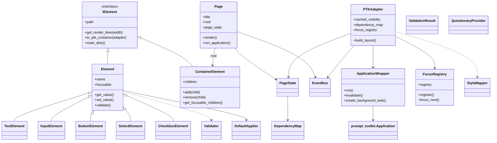
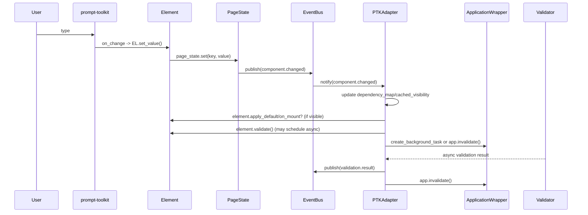

# Implementation: Class list, responsibilities, inheritance and interactions

This file contains the complete class list, responsibilities, inheritance diagram, runtime interaction sequences, focus behavior, edge cases and acceptance tests for the new `src/tui_engine` core and PTK adapter. It is intended to be included from `docs/ARCHITECTURE.md` or used as a companion document.

## Core domain classes

- IElement (interface / abstract base)
  - Purpose: minimal interface for both containers and leaves.
  - Key members:
    - path: str
    - parent: Optional[ContainerElement]
    - visible: bool
    - variant: str
    - metadata: dict
    - get_render_lines(width: int) -> List[str]
    - to_ptk_container(adapter: "PTKAdapter") -> Any
    - mark_dirty(); clear_dirty(); is_dirty() -> bool
    - on_mount(page_state: PageState) -> None
    - on_unmount(page_state: PageState) -> None

- Element (abstract leaf base)
  - Purpose: base for non-container UI elements (Text, Input, Button).
  - Fields: name, focusable, validators, default, default_factory, defer_default
  - Methods: get_value(), set_value(), validate(force=False), apply_default(page_state), get_own_result()

- ContainerElement
  - Purpose: recursive container primitive that replaces Card/Section/Assembly.
  - Fields: children: List[IElement], layout_hint (vertical/horizontal), focus_scope: bool, include_hidden_in_validity: bool
  - Methods: add(child), remove(child), child(...), convenience factories (text/input/button), get_render_lines(width), get_focusable_children(), get_effective_visibility(page_state)

- Page
  - Purpose: top-level holder; holds root ContainerElement, PageState, EventBus; exposes headless render and interactive run entrypoints.
  - Methods: add(), container(), render(width=80) -> List[str], run_application(fullscreen=False, adapter_opts={}), snapshot()/apply_snapshot()

## State, events, validation, defaults

- PageState
  - Purpose: canonical store for component values and derived meta (validation results, pending flags). Supports snapshot/restore and watch handlers.
  - Methods: get/set/set_if_absent(has atomic semantics)/has/snapshot/apply_snapshot/watch/unsubscribe

- EventBus
  - Purpose: minimal pub/sub for domain events (publish/subscribe/unsubscribe). Adapter subscribes to publish domain events and triggers redraws.

- ValidationResult & ValidationError (dataclasses)
  - ValidationResult(valid: bool, errors: List[ValidationError], pending: bool, checked_at: float, version: int)
  - ValidationError(code, message, field?, severity?)

- Validator (callable protocol)
  - Sync or async call signature: validator(value, page_state) -> ValidationResult

- DependencyMap (helper)
  - Purpose: map PageState keys -> set(element paths) so adapter recomputes only affected cached booleans.

- DefaultApplier / default factory helpers
  - Purpose: safely run sync/async default factories, capture element._version, call set_if_absent, emit `default.applied` or `default.apply_failed` events.

## Adapter & runtime (prompt-toolkit integration)

- PTKAdapter
  - Purpose: core adapter that builds the prompt-toolkit layout from a ContainerElement tree, maintains cached_visibility, dependency_map, and focus_registry; coalesces redraws and wires lifecycle hooks.
  - Key fields: app (ApplicationWrapper), page, page_state, events, cached_visibility, dependency_map, focus_registry
  - Key methods: build_layout(root) -> ptk_container, wrap_with_visibility(container, path), register_dependencies(path, keys), handle_state_change(changed_keys), _schedule_invalidate(), mount/unmount handlers

- ApplicationWrapper
  - Purpose: small wrapper around `prompt_toolkit.Application` exposing run(), stop(), invalidate(), create_background_task(), register_keybinding(). Keeps tests from importing prompt-toolkit directly.

- PTKWidgetFactory / ControlMapper
  - Purpose: map domain leaf elements (InputElement, ButtonElement, etc.) to prompt-toolkit Controls/Widgets and indicate focusability.

## Focus & keyboard navigation

- FocusRegistry
  - Purpose: ordered registry of focusable element paths, path -> ptk_control mapping, trap stack for modal focus traps, helpers for roving tabindex.
  - Methods: register(path, control, scope=None), unregister(path), focus_next(), focus_prev(), request_focus(path), trap_focus(scope_path) -> token, release_trap(token), get_focused()

- FocusScopeDescriptor
  - Small helper describing the slice used by a trap (start_index, end_index, scope_path)

## DI, styles and helpers

- QuestionaryProvider (module-level provider)
  - Purpose: inject questionary-like factories for tests and legacy code. Methods: set_factory(), get_questionary(), clear_factory()

- StyleMapper
  - Purpose: map element.variant -> prompt-toolkit style strings and wrappers (Frame, Padding).

- PromptSessionAdapter
  - Purpose: small adapter for `prompt_toolkit.PromptSession` to allow blocking prompts without a full-screen Application.

### DI hooks and testing guidance

We expose a small set of dependency-injection helper APIs to keep prompt-toolkit
integration tests hermetic and free of global monkeypatching:

- `ApplicationWrapper.set_real_app(app)` — inject a fake or real prompt-toolkit
  Application instance used by adapters. Tests should prefer this over
  assigning underscore attributes.
- `ApplicationWrapper.set_key_bindings(kb)` — inject a `key_bindings` object
  (or fake) so tests can assert registration of key handlers without importing
  prompt-toolkit.
- `PTKAdapter.register_widget_mapping(path, widget)` — register a mapping
  between a domain `element.path` and an object that represents the widget in
  tests (can be any test double). `PTKAdapter._apply_focus_to_ptk()` uses this
  mapping to transfer focus into a real app when present.

Testing guidance
- Use constructor injection and the setter helpers above for all PTK-related
  fakes. Do not monkeypatch module-level prompt-toolkit symbols. This keeps
  tests fast, isolated and compatible with CI environments that don't have a
  real terminal.
- Headless tests should assert on the stable descriptors returned by
  `ptk_widget_factory.map_element_to_widget(...)`. These descriptors contain
  `ptk_widget` (real widget or None), `on_click`, `type`, `variant`, and other
  stable keys useful for assertions.

## Leaf elements to scaffold (simple implementations for demos/tests)

- TextElement, InputElement, ButtonElement, SelectElement, CheckboxElement — minimal Element subclasses used by the examples and unit tests.

## Inheritance sketch

IElement (interface) <- Element (abstract leaf) <- TextElement/InputElement/ButtonElement/SelectElement/CheckboxElement
IElement (interface) <- ContainerElement

Page contains ContainerElement and PageState
PTKAdapter consumes Page + PageState + EventBus and produces prompt-toolkit layout via ApplicationWrapper

## Class diagram (mermaid)

## Interaction sequence (user typing / state change)

1. User types into a PTK Input (prompt-toolkit Buffer) bound to an InputElement.
2. Control calls element.set_value() -> element writes to PageState via page_state.set(key, value).
3. PageState publishes `component.changed` / watchers trigger; EventBus publishes `dependency.changed`.
4. PTKAdapter receives the event, recomputes cached_visibility for affected paths via DependencyMap, invokes mount/unmount hooks for toggles, and schedules validation (sync + async) for affected elements.
5. PTKAdapter schedules `app.invalidate()` (coalesced) via ApplicationWrapper to redraw.
6. Async validators/default factories capture element._version; results applied only when versions match to avoid race conditions.

## Focus interactions (summary)

- PTKAdapter registers each focusable control with FocusRegistry during layout build.
- Tab/Shift-Tab KeyBindings call FocusRegistry.focus_next/focus_prev, which returns a path; adapter focuses the mapped PTK control via `app.layout.focus(control)` in ApplicationWrapper.
- Modal traps are implemented as a trap_stack in FocusRegistry; top-most trap restricts Tab traversal to the trap slice.

## Edge cases and race handling

- Async validators & default factories: capture element._version on start; ignore results when version mismatches on completion.
- If the focused element is removed, FocusRegistry selects a deterministic fallback (previous index, next index, parent) and adapter publishes `focus.lost`/`focus.gained`.
- When many dependency changes happen rapidly, PTKAdapter coalesces recomputation and publishes a single `validity.changed` per element per batch where possible.

## Acceptance tests (quick list)

- Container composition & get_render_lines snapshot tests.
- Page.render() headless output for simple demos.
- PageState.set_if_absent concurrency test (simulate concurrent default factories).
- EventBus publish/subscribe unit test.
- PTKAdapter.build_layout() smoke test (non-fullscreen / mocked prompt-toolkit).
- FocusRegistry tab traversal & modal trap tests.

